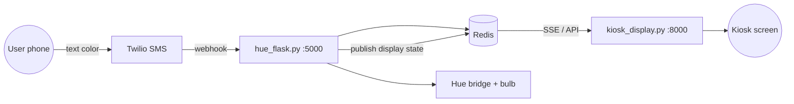
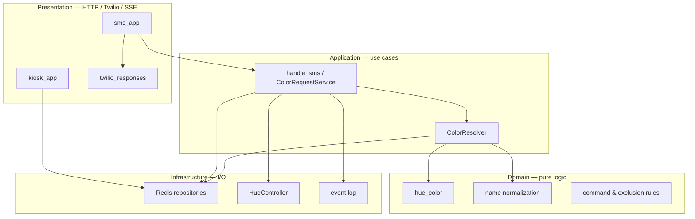
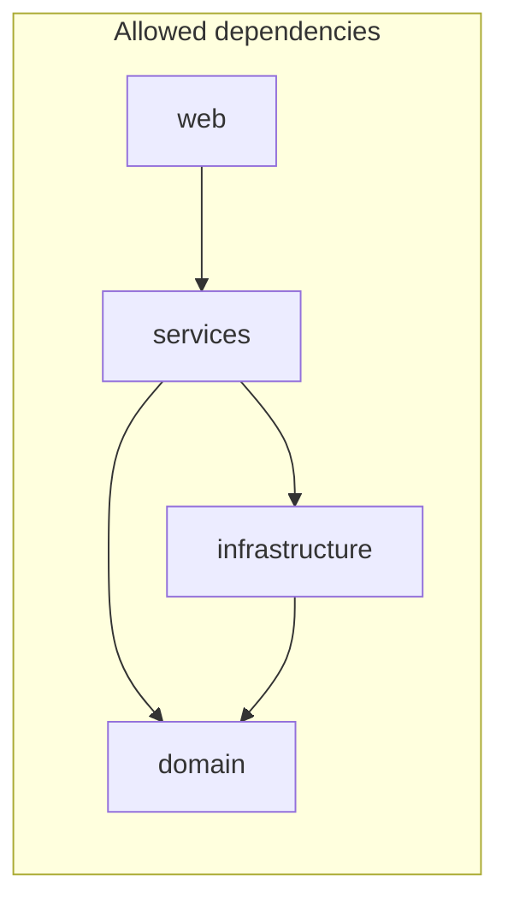

# Architecture & Design

This document describes how **hue_sms** is structured today, what problems that causes, and how we plan to reorganize the code over time. It is a **design reference**, not a mandate to refactor everything at once. Changes should land in small, reviewable steps while the system keeps working.

For day-to-day setup and commands, see [setup.md](setup.md) and [developers.MD](developers.MD).

---

## System overview

hue_sms connects four external systems:

| System | Role |
|--------|------|
| **Twilio** | Receives SMS and POSTs to the Flask webhook |
| **Redis** | Palette, usage stats, kiosk display state, pub/sub |
| **Philips Hue bridge** | Drives the physical bulb |
| **Kiosk browser** | Full-screen display fed by SSE from a second Flask app |



### Request flow (happy path)

1. User texts a color name (e.g. `cerulean`) to the Twilio number.
2. Twilio calls `POST /sms` on the SMS server.
3. The server normalizes the name, looks up RGB in Redis, validates the color is showable on a Hue bulb, and converts sRGB → CIE xy + brightness.
4. The server sets the bulb and publishes display state to Redis.
5. The kiosk server streams the update to the browser via Server-Sent Events.

Special commands (`random`, `next`, `options`, hex codes, fuzzy matches) follow the same pipeline with different resolution logic upstream of the bulb.

---

## Current layout (`src/`)

Today all Python modules live in a **flat** `src/` directory. Scripts are run with `cd src && python …`, and imports are module-to-module (e.g. `from getRedisColor import getColor`).

| Module | Responsibility |
|--------|----------------|
| `hue_flask.py` | SMS webhook, command routing, orchestration, Twilio replies |
| `kiosk_display.py` | Kiosk HTTP API, SSE stream, QR code |
| `hue_controller.py` | Hue bridge connection and bulb control |
| `hue_color.py` | sRGB → Hue xy/brightness; exclusion rules; gamut tuning |
| `display_state.py` | Kiosk state in Redis, recent picks, cycle index, pub/sub |
| `getRedisColor.py` | Single-function Redis palette lookup |
| `colors_redis.py` | Alternate Redis wrapper (partially redundant) |
| `fuzzyColors.py` | Fuzzy name matching against Redis palette |
| `name_converter.py` | Name normalization; legacy CSV-backed `NameConverter` |
| `data_writer.py` | Append-only CSV log + analytics helpers |
| `palette.py` | Load palette for kiosk API (Redis with CSV fallback) |
| `createRedis.py` / `sync_colors.py` | Load or merge CSV palette into Redis |
| `adjust_colors_for_hue.py` | Rewrite CSV RGB values for bulb gamut |
| `health_check.py` | Redis / Hue / cross-service health probes |
| `generate_colors/scrape_colors.py` | Scrape Wikipedia Crayola tables → `colors.csv` |

### What works well

- **`hue_color.py`** — Pure color logic with no I/O. Good separation already.
- **`display_state.py`** — Clear Redis keys and pub/sub channel for the kiosk.
- **`kiosk_display.py`** — Mostly thin HTTP/SSE over `display_state`.
- **Palette tooling** — Scrape → CSV → sync into Redis is a sensible offline pipeline.

### Pain points (why refactor)

| Issue | Where it shows up | Effect |
|-------|-------------------|--------|
| **God module** | `hue_flask.py` `set_color()` | ~180 lines mixing Twilio, Redis, fuzzy match, Hue, display, CSV, stats — hard to test and read |
| **Duplicated Redis** | 10+ files open `redis.Redis(host='localhost', …)` | Inconsistent options; no single place to configure or mock |
| **Dual history stores** | `data.csv` + Redis (`color_totals`, `display:recent_picks`) | Kiosk hydrates recent picks from CSV; analytics routes read CSV; stats read Redis |
| **Dead / duplicate paths** | `HueController.name_to_color` unused; `getRedisColor` vs `colors_redis` | Confusing for new readers |
| **No package boundaries** | Flat imports, `cd src` to run | Dependency direction is invisible; hard to enforce layering |
| **Scattered config** | `Dynaconf` and `logging.basicConfig` in multiple entrypoints | Settings and logging behavior differ by script |

---

## Target architecture

The goal is **four layers**. Dependencies point **inward only**: presentation → application → domain; infrastructure is wired in from the outside.



### Layer rules

| Layer | May import | Must not import |
|-------|------------|-----------------|
| **Domain** | stdlib, small pure libs | `redis`, `phue`, `flask`, `twilio`, filesystem for app data |
| **Infrastructure** | domain, third-party I/O libs | Flask routes, Twilio |
| **Application** | domain + infrastructure (prefer narrow interfaces) | Flask request objects |
| **Presentation** | application services | Direct Redis/Hue calls in route handlers |

These rules are aspirational during migration. New code should follow them; old code can be moved incrementally.

---

## Proposed package layout

When we refactor, modules move under a single installable package. Names are **snake_case**. Entry points stay runnable as `python -m hue_sms.web.sms_app` (exact CLI TBD).

```
src/hue_sms/
  __init__.py
  config.py                     # single Dynaconf settings + logging setup

  domain/
    color.py                    # current hue_color.py
    names.py                    # clean_name, display formatting
    commands.py                 # OPTIONS, RANDOM, NEXT, BLACK, etc.

  infrastructure/
    redis_client.py             # one connection factory
    palette_repository.py       # colors hash: get, list, exists
    stats_repository.py         # color_totals, total, percent
    display_repository.py       # display state, recent picks, cycle index
    hue_controller.py
    event_log.py                # replaces or wraps data.csv

  services/
    color_resolver.py           # hex / palette / fuzzy → resolved color or error
    handle_sms.py               # orchestrate one SMS request end-to-end

  web/
    sms_app.py                  # thin Flask app (port 5000)
    kiosk_app.py                # thin Flask app (port 8000)
    twilio_responses.py         # build TwiML strings

  cli/
    load_palette.py             # was createRedis.py
    sync_palette.py             # was sync_colors.py
    adjust_palette.py           # was adjust_colors_for_hue.py

  tools/
    scrape_colors.py
    plotlydash.py

  data/                         # optional: colors.csv, extra_colors.csv
    colors.csv
    extra_colors.csv

tests/
  test_color.py
  test_color_resolver.py
  test_handle_sms.py
  ...
```

### Current → proposed mapping

| Current file | Proposed home | Notes |
|--------------|---------------|-------|
| `hue_color.py` | `domain/color.py` | Move as-is; already clean |
| `name_converter.py` | `domain/names.py` | Drop unused `NameConverter` CSV path from controller |
| `hue_flask.py` (logic) | `services/handle_sms.py` | Extract from route handler |
| `hue_flask.py` (routes) | `web/sms_app.py` | Thin wiring only |
| `getRedisColor.py` | `infrastructure/palette_repository.py` | Fold in `colors_redis.py` |
| `fuzzyColors.py` | `services/color_resolver.py` | Stop opening Redis inside; use repo |
| `display_state.py` | `infrastructure/display_repository.py` | Remove CSV fallback import |
| `data_writer.py` | `infrastructure/event_log.py` | Migrate to Redis-only or optional export |
| `hue_controller.py` | `infrastructure/hue_controller.py` | Remove dead `NameConverter` |
| `kiosk_display.py` | `web/kiosk_app.py` | Mostly unchanged |
| `palette.py` | `infrastructure/palette_repository.py` or `web` helper | Single palette source |
| `createRedis.py` | `cli/load_palette.py` | |
| `sync_colors.py` | `cli/sync_palette.py` | |
| `health_check.py` | `infrastructure/health.py` | |

---

## Core abstractions

### Resolved color (application result)

Orchestration code should work with structured results, not scattered flags (`is_Fuzzy`, `is_Hex`, …):

```python
# Conceptual — not implemented yet

@dataclass
class ResolvedColor:
    key: str              # normalized lookup key
    display_name: str     # shown on kiosk / in SMS
    rgb: tuple[int, int, int]
    match_kind: str       # "exact" | "fuzzy" | "hex" | "random" | "cycle"

@dataclass
class ColorError:
    message: str          # user-facing SMS text
    reason: str           # "unknown" | "unsupported" | "empty" | "hue_offline"
    display_mode: str     # "unsupported" | None
```

### Color request service

One function (or small class) owns the use case currently inside `set_color()`:

```
handle_color_request(body, from_number) → Success | ColorError | CommandReply
```

Steps inside the service:

1. Record webhook metadata (optional audit).
2. Normalize input (`clean_name`).
3. Branch on commands (`options`, `random`, `next`, …).
4. Resolve color (`ColorResolver`: palette → fuzzy → hex).
5. Validate (`is_excluded_palette_color`, unsupported name heuristics).
6. Set bulb (`HueController.set_rgb`).
7. Publish kiosk state (`display_repository.publish`).
8. Update stats (`stats_repository.increment`).
9. Append event log (if still using CSV during migration).
10. Return message text for Twilio.

The Flask route only parses the request, calls the service, and returns TwiML.

### Repositories (infrastructure)

Each repository owns a slice of Redis keys:

| Repository | Redis keys | Operations |
|------------|------------|------------|
| **Palette** | `colors` | `get_rgb(name)`, `list_names()`, `exists(name)` |
| **Stats** | `color_totals`, `total` | `increment(name)`, `percent(name)` |
| **Display** | `display:state`, `display:updates`, `display:recent_picks`, `display:cycle_index` | `publish`, `get_state`, `recent`, `advance_cycle` |
| **Webhook audit** | `webhook:last` | `record`, `get_last` |

All repositories receive a shared Redis client from `redis_client.get_redis()` fed by `config.py`.

### Configuration (single source)

Extend `settings.toml` over time; read everything through one module:

```toml
light_ip = "192.168.1.100"
light_number = 0
hue_gamut = "C"
sms_phone_display = "555-123-4567"

# Future — optional during migration
redis_host = "localhost"
redis_port = 6379
redis_db = 0
event_log_path = "data.csv"    # empty or omit to disable CSV
hue_health_url = "http://127.0.0.1:5000/health"
```

---

## Data stores

### Today

| Data | Primary store | Secondary / legacy |
|------|---------------|-------------------|
| Palette (name → RGB) | Redis `colors` | `colors.csv`, `extra_colors.csv` |
| Usage counts | Redis `color_totals`, `total` | — |
| Kiosk current state | Redis `display:state` | — |
| Recent picks | Redis `display:recent_picks` | CSV via `data_writer.recent_picks` fallback |
| Per-request log | CSV `data.csv` | — |
| SMS reply “% since date” | Redis percent + CSV first row date | — |

### Target

| Data | Store | Notes |
|------|-------|-------|
| Palette | Redis (loaded from CSV by CLI) | CSV remains source for scraping/editing |
| Usage counts | Redis only | |
| Kiosk state + recent picks | Redis only | Remove CSV hydration from `display_state` |
| Event history | Redis list/stream **or** optional CSV export | Pick one primary; CSV as export if needed |
| Analytics (`plotlydash`, `/recents`) | Same primary store as events | Avoid dual queries |

**Principle:** Redis is the **runtime** source of truth. CSV files are **build artifacts** for the palette, not something the live SMS path reads except during `sync_palette` / `load_palette`.

---

## Dependency diagram (target)



**Forbidden examples:**

- `domain/color.py` importing `redis` — color math must stay pure.
- `display_repository.py` importing `data_writer` — display should not know about CSV.
- `hue_controller.py` loading `colors.csv` — bulb driver should not own palette data.

---

## Testing strategy

| Layer | How to test |
|-------|-------------|
| **Domain** | Unit tests with fixed RGB inputs (existing `test_hue_color.py` pattern) |
| **ColorResolver** | Fake palette repo returning a small dict; no Redis |
| **handle_sms** | Mock `HueController`, repos, and event log; assert messages and side effects |
| **Infrastructure** | Integration tests with inline `FakeRedis` fakes or `fakeredis` in unit tests |
| **Web** | Flask test client for routes; delegate logic to tested services |

Goal: **business logic tests run without Redis, Hue, or Twilio.**

---

## Incremental migration plan

Work in small PRs. Each step should leave the project runnable and tests passing.

| Phase | Scope | Risk |
|-------|--------|------|
| **0 — Document** | This file; agree on layers with reviewers | None |
| **1 — Config** | Add `config.py`; centralize Redis host/port | Low — **done** (`src/config.py`) |
| **2 — Resolver** | Extract color resolution from `hue_flask.py`; add tests | Low — **done** (`src/color_resolver.py`) |
| **3 — Service** | Extract `handle_color_request`; thin Flask route | Medium — **done** (`src/handle_sms.py`) |
| **4 — Repositories** | Replace `getRedisColor`, inline Redis in fuzzy/stats | Medium — **done** (`*_repository.py`) |
| **5 — History** | Unify event/recent data in Redis; deprecate CSV fallback | Medium — **done** (`event_repository.py`) |
| **6 — Package move** | `src/hue_sms/` layout; update imports and docs | Medium — **done** |
| **7 — Cleanup** | Remove dead code, rename scripts, delete duplicates | Low — **done** |

**Out of scope for early phases:** changing Twilio/Hue behavior, palette contents, or kiosk UI.

---

## Open decisions

Record choices here as the team reviews the design:

| Question | Options | Decision |
|----------|---------|----------|
| Event log primary store | Redis list vs Redis stream vs keep CSV | **Redis list** (`events:log`); optional `csv_event_export = true` in settings |
| Package rename timing | Before or after service extraction | **After** — extract logic first (Phases 2–4), move folders in Phase 6 |
| `Rgb` value type | Keep `"r,g,b"` strings vs small dataclass | **Keep strings for now** — less churn while refactoring |
| Single Flask app vs two | Keep SMS (:5000) and kiosk (:8000) separate | **Keep separate** — different deploy/scaling |
| `NameConverter` CSV class | Delete vs keep for offline tools only | **Keep in domain** for offline/tests; removed from `HueController` |

---

## Glossary

| Term | Meaning |
|------|---------|
| **Palette** | Map of normalized color names to sRGB triples |
| **Excluded color** | Black, neutral grays, muted browns — filtered from palette and rejected at runtime |
| **Gamut A/B/C** | Philips Hue LED color space variants; affects xy conversion |
| **Spotlight mode** | Kiosk UI state showing the current color full-screen |
| **Unsupported mode** | Kiosk UI state when user picks a non-showable color |

---

## Related docs

| Doc | Purpose |
|-----|---------|
| [README.md](../README.md) | Project intro and quick start |
| [setup.md](setup.md) | Production / demo setup |
| [developers.MD](developers.MD) | Dev environment, tests, palette maintenance |
| [resources.md](resources.md) | Color theory and API links |
